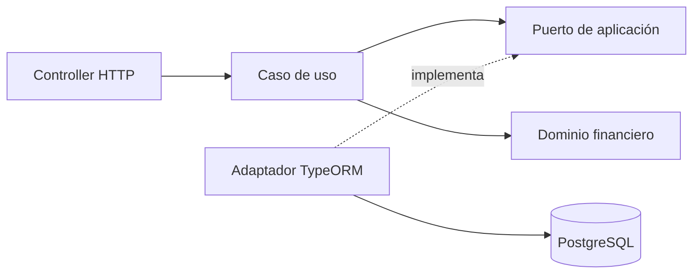

# Cocos Capital · Backend Challenge

<p align="center">
  
</p>

API REST de inversiones desarrollada con Node.js, NestJS, TypeScript y PostgreSQL.

## Alcance y estado

| Funcionalidad       | Alcance                                                          | Estado       |
| ------------------- | ---------------------------------------------------------------- | ------------ |
| Buscar instrumentos | Coincidencias por ticker o nombre, con paginación.               | Implementado |
| Enviar órdenes      | BUY/SELL, MARKET/LIMIT, cantidad o monto y rechazos persistidos. | Pendiente    |
| Consultar portfolio | Efectivo, valor total, posiciones y rendimiento.                 | Pendiente    |
| Health              | Disponibilidad de la API y PostgreSQL.                           | Implementado |

También están implementados los cálculos compartidos de dinero, efectivo y tenencias. El test funcional de envío de órdenes está pendiente junto con ese endpoint.

## Ejecutar el proyecto

Requisitos: Node.js 24 y npm. Desde la raíz del proyecto:

```bash
npm ci
test -f .env || cp .env.example .env
```

El comando conserva `.env` si ya existe. Elegir una de estas opciones para la base:

- **Base de datos en la nube:** configurar `DATABASE_URL` en `.env` con la conexión a PostgreSQL y los datos del challenge ya cargados. No requiere Docker.
- **Base de datos local:** usar los valores locales de `.env.example` y ejecutar el siguiente comando. Requiere Docker con Compose.

```bash
npm run db:up
```

Compose carga [database.sql](database/database.sql) al crear el volumen por primera vez y conserva sus datos al detenerlo. Si `5432` está ocupado, ajustar `POSTGRES_PORT` y el puerto de `DATABASE_URL` en `.env` para que coincidan.

Con la base configurada, iniciar la API:

```bash
npm run start:dev
```

La API queda disponible en `http://localhost:3000`. Para ejecutar la versión compilada, usar `npm run build && npm run start:prod`.

## Probar la API

Las solicitudes están preparadas en [cocos-capital.http](docs/api/cocos-capital.http):

1. Instalar la extensión [REST Client](https://marketplace.visualstudio.com/items?itemName=humao.rest-client) en VS Code y abrir el archivo.
2. Pulsar **Send Request** sobre `Application and database readiness - 200` para comprobar que la API y la base estén disponibles.
3. Ejecutar `Search by ticker - 200`. Con los datos provistos, devuelve GGAL (id 34) en `data`.
4. Recorrer los demás casos: búsqueda por nombre, paginación, exclusión de moneda y búsqueda sin coincidencias. `Invalid pagination - 400` comprueba un error intencional.

El archivo define `baseUrl=http://localhost:3000`; ajustar ese valor si cambia el puerto de la API. No se requiere autenticación.

Como alternativa desde el navegador, abrir [Swagger](http://localhost:3000/api/docs) y usar **Try it out** en `GET /instruments`. El [contrato HTTP](docs/api/README.md) detalla parámetros, respuestas y errores.

La búsqueda acepta `search`, `limit` (20 por defecto) y `offset` (0 por defecto). Devuelve `{ data, meta }`; sin coincidencias responde `200` con `data: []`.

## Ejecutar las verificaciones

```bash
# Formato, tipos, lint, pruebas unitarias y build; no requiere PostgreSQL.
npm run verify

# Verificación anterior más pruebas HTTP/e2e contra PostgreSQL aislado.
npm run verify:all
```

`verify:all` requiere Docker con Compose e inicia una base aislada (`cocos_test`, puerto `5433`). Los e2e crean y eliminan fixtures allí; no usan `.env` ni la base proporcionada. Para detener los servicios locales conservando sus datos, ejecutar `npm run db:down`.

Las pruebas actuales cubren dinero, reconstrucción de recursos, health y búsqueda. El detalle de cobertura y sus límites están en el [contrato HTTP](docs/api/README.md#persistencia-y-verificaciones) y la [guía de dominio compartido](src/shared/README.md).

## Diseño y decisiones

Monolito modular con separación de HTTP, aplicación, dominio y persistencia:



- `instruments`: búsqueda del catálogo negociable.
- `orders`: validación y persistencia de órdenes.
- `portfolio`: reconstrucción, valuación y rendimiento.
- `shared`: dinero, movimientos, cotizaciones, persistencia y errores HTTP reutilizados.

Los controllers y DTOs pertenecen a infraestructura; los casos de uso y el dominio no dependen de NestJS ni TypeORM. La [guía de arquitectura](docs/architecture.md) contiene el árbol completo, los límites entre módulos y la estrategia de consistencia.

| Decisión implementada                             | Motivo                                                          |
| ------------------------------------------------- | --------------------------------------------------------------- |
| Catálogo limitado a `ACCIONES`                    | `MONEDA` representa el efectivo de la cuenta.                   |
| Búsqueda parametrizada y ordenada por ticker e id | Tratar el texto como dato y desempatar resultados paginados.    |
| Cálculos compartidos con `decimal.js`             | Conservar precisión monetaria y redondear al presentar.         |
| Recursos reconstruidos desde movimientos `FILLED` | Separar operaciones ejecutadas de pendientes y rechazos.        |
| Errores HTTP con Problem Details                  | Mantener un formato común sin exponer detalles de persistencia. |

Los criterios financieros y las decisiones pendientes de órdenes y portfolio están en [supuestos funcionales](docs/assumptions.md). La transacción con bloqueo por usuario sigue pendiente de implementación y pruebas con el endpoint de órdenes.

## Documentación técnica

| Documento                                            | Contenido                                  |
| ---------------------------------------------------- | ------------------------------------------ |
| [Contrato HTTP](docs/api/README.md)                  | Rutas, validaciones, respuestas y errores. |
| [Supuestos funcionales](docs/assumptions.md)         | Decisiones financieras y pendientes.       |
| [PostgreSQL](database/README.md)                     | Entorno local, esquema, TLS y migraciones. |
| [Dominio compartido](src/shared/README.md)           | Dinero, recursos y cotizaciones.           |
| [Evidencias de performance](docs/evidence/README.md) | Procedimiento y resultados de mediciones.  |

Las variables se validan al iniciar y las migraciones se ejecutan mediante comandos explícitos. No hay mediciones de performance publicadas todavía.
