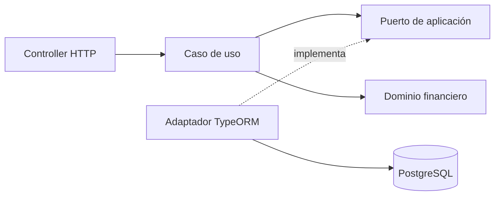

# Cocos Capital · Backend Challenge

<p align="center">
  
</p>

API REST de inversiones desarrollada con Node.js, NestJS, TypeScript y PostgreSQL. Implementa los tres endpoints solicitados para buscar instrumentos, consultar un portfolio y enviar órdenes.

## Alcance y estado

| Endpoint                       | Responsabilidad                                                | Estado       |
| ------------------------------ | -------------------------------------------------------------- | ------------ |
| `GET /instruments`             | Buscar activos por ticker o nombre y ver su último cierre.     | Implementado |
| `GET /users/:userId/portfolio` | Obtener patrimonio, disponibilidad, posiciones y rendimientos. | Implementado |
| `POST /orders`                 | Enviar BUY/SELL MARKET/LIMIT por cantidad o monto.             | Implementado |
| `GET /health`                  | Comprobar la disponibilidad de la API y PostgreSQL.            | Implementado |

Las órdenes con recursos insuficientes se guardan como `REJECTED`. Las MARKET aceptadas quedan `FILLED` y las LIMIT aceptadas quedan `NEW`. Portfolio distingue el saldo ejecutado de los recursos reservados por órdenes pendientes. Los precios e importes se expresan en ARS. No se requiere autenticación.

## Evaluación rápida

Requisitos para la ruta principal: Node.js 24 y npm. Docker con Compose permite iniciar PostgreSQL local. Para ejecutar [API y base en contenedores](#alternativa-api-y-postgresql-con-docker), se pueden omitir los pasos 1–3 y no hace falta Node en el host.

### 1. Preparar el proyecto

```bash
npm ci
test -f .env || cp .env.example .env
```

El segundo comando crea `.env` desde el ejemplo sólo si todavía no existe.

### 2. Elegir la base de datos

Se puede elegir entre dos opciones. Ambas usan el esquema y los datos iniciales del challenge.

#### Opción A: local con el dump provisto (recomendada)

El `.env` copiado en el paso anterior ya apunta a esta base. Iniciarla con:

```bash
npm run db:up
```

Compose crea PostgreSQL y carga [database.sql](database/database.sql) automáticamente la primera vez. Esta opción es descartable y permite probar `POST /orders` sin modificar la base compartida.

Si `5432` está ocupado, hay que ajustar `POSTGRES_PORT` y el puerto de `DATABASE_URL` en `.env` para que coincidan.

#### Opción B: Neon provista

Reemplazar la `DATABASE_URL` activa de `.env` por la URL de Neon recibida con el challenge. No hay que ejecutar `npm run db:up` ni importar el dump, porque esa base ya contiene los datos iniciales.

`POST /orders` escribe movimientos. Usar esta opción para órdenes sólo si está permitido modificar la base provista.

### 3. Aplicar la migración e iniciar la API

Estos comandos son iguales para cualquiera de las dos opciones:

```bash
npm run migration:run
npm run start:dev
```

`migration:run` agrega la tabla de idempotencia si la migración está pendiente. La API no ejecuta migraciones al iniciar y mantiene `synchronize: false`.

La API queda disponible en `http://localhost:3000` y Swagger en `http://localhost:3000/api/docs`.

Para ejecutar la versión compilada:

```bash
npm run build
npm run start:prod
```

### Alternativa: API y PostgreSQL con Docker

Si no se quiere instalar Node.js en el host, Docker puede construir la imagen y Compose ejecutar ambos servicios con el seed local:

```bash
docker compose up -d --wait postgres
docker build -t cocos-backend-challenge-api .
docker compose --profile app run --rm api node ./node_modules/typeorm/cli.js migration:run -d dist/shared/infrastructure/persistence/data-source.js
docker compose --profile app up -d --no-build api
```

La migración se aplica explícitamente antes de iniciar la API; el contenedor no modifica el esquema al arrancar. La API queda en `http://localhost:3000`. Para detenerla junto con PostgreSQL, ejecutar `docker compose --profile app down`; los volúmenes conservan los datos hasta eliminarlos expresamente.

## Probar la API

Las solicitudes están preparadas en [cocos-capital.http](docs/api/cocos-capital.http). El archivo usa `baseUrl=http://localhost:3000` y no requiere autenticación.

1. Instalar la extensión [REST Client](https://marketplace.visualstudio.com/items?itemName=humao.rest-client) en VS Code y abrir el archivo.
2. Pulsar **Send Request** sobre `Application and database readiness - 200` para comprobar que la API y la base estén disponibles.
3. Ejecutar `Search by ticker - 200`. Con los datos provistos, devuelve GGAL (id 34), su cierre histórico y la variación diaria en `data`.
4. Ejecutar `User portfolio - 200`: el usuario 1 tiene saldo `753000.00`, efectivo reservado `125500.00`, disponible `627500.00` y valor total `889756.00`. También conserva la posición heredada de BMA de −10 acciones.
5. Ejecutar los casos de órdenes sobre la base local descartable recomendada. Si se eligió Neon, tener en cuenta que `POST /orders` crea movimientos y modifica los portfolios posteriores.

Como alternativa desde el navegador, abrir [Swagger](http://localhost:3000/api/docs) y usar **Try it out**. El [contrato HTTP](docs/api/README.md) detalla parámetros, respuestas y errores.

`POST /orders` exige un UUID v4 en `Idempotency-Key`. Repetir la misma clave y el mismo body devuelve el resultado original sin crear otra orden. El REST Client incluye ejemplos de MARKET, LIMIT, rechazo financiero, replay y entradas inválidas.

## Verificación automatizada

| Comando                    | Alcance                                                                 | PostgreSQL |
| -------------------------- | ----------------------------------------------------------------------- | ---------- |
| `npm run test:unit`        | Dinero, recursos y reglas financieras aisladas.                         | No         |
| `npm run test:feature`     | Contratos HTTP con puertos de persistencia simulados.                   | No         |
| `npm run test:integration` | HTTP, SQL, migraciones, persistencia, concurrencia e idempotencia real. | Sí         |
| `npm run verify`           | Formato, tipos, lint, unit, feature y build.                            | No         |
| `npm run verify:all`       | Verificación completa, incluida la integración con PostgreSQL aislado.  | Sí         |

La comprobación completa recomendada es:

```bash
npm run verify:all
npm run db:down
```

`verify:all` inicia `cocos_test` en `127.0.0.1:5433`, ejecuta las migraciones necesarias y corre las tres suites.

Para ejecutar solo la integración y consultar sus restricciones de seguridad, ver la [guía de PostgreSQL](database/README.md#base-de-pruebas).

## Diseño y decisiones

Monolito modular con separación de HTTP, aplicación, dominio y persistencia:



- `instruments`: búsqueda del catálogo negociable.
- `orders`: validación y persistencia de órdenes.
- `portfolio`: saldo, reservas, valuación y rendimiento.
- `shared`: dinero, recursos, lecturas de usuarios y mercado, persistencia y errores HTTP reutilizados.

Los controllers y DTOs pertenecen a infraestructura. Los casos de uso y el dominio no dependen de NestJS ni TypeORM. La [guía de arquitectura](docs/architecture.md) contiene el árbol completo, los límites entre módulos y la estrategia de consistencia.

| Decisión implementada                             | Motivo                                                          |
| ------------------------------------------------- | --------------------------------------------------------------- |
| Catálogo limitado a `ACCIONES`                    | `MONEDA` representa el efectivo de la cuenta.                   |
| Búsqueda parametrizada y ordenada por ticker e id | Tratar el texto como dato y desempatar resultados paginados.    |
| Último cierre disponible en el catálogo           | Ayudar a comparar activos sin presentarlo como precio en vivo.  |
| Cálculos compartidos con `decimal.js`             | Conservar precisión monetaria y redondear al presentar.         |
| Saldo y posiciones derivados de `FILLED`          | Reflejar únicamente operaciones ejecutadas en el patrimonio.    |
| Recursos reservados por órdenes `NEW`             | Mostrar y validar cuánto efectivo y tenencia sigue disponible.  |
| Errores HTTP con Problem Details                  | Mantener un formato común sin exponer detalles de persistencia. |
| Portfolio con snapshot de solo lectura            | Evitar mezclar movimientos y cotizaciones de distintos estados. |
| Órdenes atómicas con bloqueo por usuario          | Evitar que solicitudes simultáneas consuman el mismo recurso.   |
| Idempotencia durable en PostgreSQL                | Confirmar clave, resultado y orden en la misma transacción.     |

Los criterios financieros están en [supuestos funcionales](docs/assumptions.md).

## Documentación técnica

El [índice de documentación](docs/README.md) reúne el contrato HTTP, los supuestos, la arquitectura, los diagramas y las guías de base de datos y dominio compartido.
