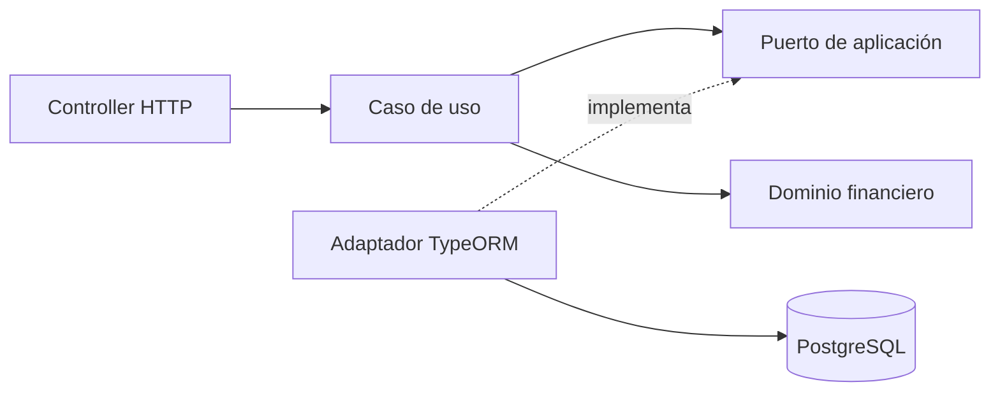

# Cocos Capital · Backend Challenge

<p align="center">
  
</p>

API REST de inversiones desarrollada con Node.js, NestJS, TypeScript y PostgreSQL. Implementa los tres endpoints solicitados para buscar instrumentos, consultar un portfolio y enviar órdenes.

## Alcance y estado

| Endpoint                       | Responsabilidad                                                        | Estado       |
| ------------------------------ | ---------------------------------------------------------------------- | ------------ |
| `GET /instruments`             | Buscar activos negociables por ticker o nombre, con paginación.        | Implementado |
| `GET /users/:userId/portfolio` | Obtener efectivo, valor total, posiciones y rendimientos de la cuenta. | Implementado |
| `POST /orders`                 | Enviar BUY/SELL MARKET/LIMIT por cantidad o monto.                     | Implementado |
| `GET /health`                  | Comprobar la disponibilidad de la API y PostgreSQL.                    | Implementado |

Las órdenes con recursos insuficientes se guardan como `REJECTED`. Las MARKET aceptadas quedan `FILLED` y las LIMIT aceptadas quedan `NEW`. Los precios e importes se expresan en ARS. No se requiere autenticación.

## Evaluación rápida

Requisitos: Node.js 24 y npm. Docker con Compose sólo es necesario para usar PostgreSQL local o ejecutar la integración automatizada.

### 1. Preparar el proyecto

```bash
npm ci
test -f .env || cp .env.example .env
```

El segundo comando crea `.env` desde el ejemplo sólo si todavía no existe.

### 2. Iniciar PostgreSQL y la API

La opción recomendada para evaluar la entrega es la base local, porque `POST /orders` escribe movimientos:

```bash
npm run db:up
npm run migration:run
npm run start:dev
```

Compose carga [database.sql](database/database.sql) al crear el volumen por primera vez. La migración agrega la tabla de idempotencia y se ejecuta de forma explícita. La API mantiene `synchronize: false`.

La API queda disponible en `http://localhost:3000` y Swagger en `http://localhost:3000/api/docs`. Si `5432` está ocupado, hay que ajustar `POSTGRES_PORT` y el puerto de `DATABASE_URL` en `.env` para que coincidan.

Para usar otra instancia de PostgreSQL, configurar `DATABASE_URL` en `.env` y ejecutar `npm run migration:run` antes de iniciar la API. Las órdenes deben probarse únicamente sobre una base en la que esté permitido escribir.

Para ejecutar la versión compilada:

```bash
npm run build
npm run start:prod
```

## Probar la API

Las solicitudes están preparadas en [cocos-capital.http](docs/api/cocos-capital.http). El archivo usa `baseUrl=http://localhost:3000` y no requiere autenticación.

1. Instalar la extensión [REST Client](https://marketplace.visualstudio.com/items?itemName=humao.rest-client) en VS Code y abrir el archivo.
2. Pulsar **Send Request** sobre `Application and database readiness - 200` para comprobar que la API y la base estén disponibles.
3. Ejecutar `Search by ticker - 200`. Con los datos provistos, devuelve GGAL (id 34) en `data`.
4. Ejecutar `User portfolio - 200`: el usuario 1 tiene efectivo `753000.00` y valor total `889756.00`, incluyendo la posición heredada de BMA de −10 acciones.
5. Ejecutar los casos de órdenes únicamente sobre una base local descartable. `POST /orders` crea movimientos y modifica los portfolios posteriores.

Como alternativa desde el navegador, abrir [Swagger](http://localhost:3000/api/docs) y usar **Try it out**. El [contrato HTTP](docs/api/README.md) detalla parámetros, respuestas y errores.

`POST /orders` exige un UUID v4 en `Idempotency-Key`. Repetir la misma clave y el mismo body devuelve el resultado original sin crear otra orden. El REST Client incluye ejemplos de MARKET, LIMIT, rechazo financiero, replay y entradas inválidas.

## Verificación automatizada

| Comando                    | Alcance                                                                 | PostgreSQL |
| -------------------------- | ----------------------------------------------------------------------- | ---------- |
| `npm run test:unit`        | Dinero, recursos y reglas financieras aisladas.                         | No         |
| `npm run test:feature`     | Contratos HTTP con puertos de persistencia simulados.                   | No         |
| `npm run test:integration` | HTTP, SQL, migraciones, persistencia, concurrencia e idempotencia real. | Sí         |
| `npm run verify`           | Formato, tipos, lint, unit, feature y build.                            | No         |
| `npm run verify:all`       | Verificación completa, incluida la integración con PostgreSQL aislado.  | Sí         |

La comprobación completa recomendada es:

```bash
npm run verify:all
npm run db:down
```

`verify:all` inicia `cocos_test` en `127.0.0.1:5433`, ejecuta las migraciones necesarias y corre las tres suites. El resultado actual es de 73 casos: 29 unitarios, 23 feature y 21 de integración.

La separación responde al costo de cada prueba. Las suites unitarias concentran las reglas financieras, las feature recorren el contrato HTTP sin infraestructura y las integraciones se reservan para SQL, transacciones, bloqueos e idempotencia real. Así se mantiene feedback rápido sin dejar los riesgos de persistencia cubiertos sólo por mocks.

Para ejecutar sólo la integración:

```bash
npm run db:up:test
npm run test:integration
```

Los tests crean y eliminan sus propios fixtures. La configuración sólo acepta hosts loopback y bases cuyo nombre termine en `_test`, por lo que no utiliza `.env` ni la base proporcionada. `test:e2e` se conserva como alias de `test:integration`. El detalle de cobertura está en el [contrato HTTP](docs/api/README.md#persistencia-y-verificaciones).

## Diseño y decisiones

Monolito modular con separación de HTTP, aplicación, dominio y persistencia:



- `instruments`: búsqueda del catálogo negociable.
- `orders`: validación y persistencia de órdenes.
- `portfolio`: reconstrucción, valuación y rendimiento.
- `shared`: dinero, recursos, lecturas de usuarios y mercado, persistencia y errores HTTP reutilizados.

Los controllers y DTOs pertenecen a infraestructura. Los casos de uso y el dominio no dependen de NestJS ni TypeORM. La [guía de arquitectura](docs/architecture.md) contiene el árbol completo, los límites entre módulos y la estrategia de consistencia.

| Decisión implementada                             | Motivo                                                          |
| ------------------------------------------------- | --------------------------------------------------------------- |
| Catálogo limitado a `ACCIONES`                    | `MONEDA` representa el efectivo de la cuenta.                   |
| Búsqueda parametrizada y ordenada por ticker e id | Tratar el texto como dato y desempatar resultados paginados.    |
| Cálculos compartidos con `decimal.js`             | Conservar precisión monetaria y redondear al presentar.         |
| Recursos reconstruidos desde movimientos `FILLED` | Separar operaciones ejecutadas de pendientes y rechazos.        |
| Errores HTTP con Problem Details                  | Mantener un formato común sin exponer detalles de persistencia. |
| Portfolio con snapshot de solo lectura            | Evitar mezclar movimientos y cotizaciones de distintos estados. |
| Órdenes atómicas con bloqueo por usuario          | Evitar que solicitudes simultáneas consuman el mismo recurso.   |
| Idempotencia durable en PostgreSQL                | Confirmar clave, resultado y orden en la misma transacción.     |

Los criterios financieros y las decisiones de órdenes están en [supuestos funcionales](docs/assumptions.md). Cada orden se evalúa y se persiste dentro de una única transacción, incluido el bloqueo de la cuenta y el cálculo de recursos disponibles.

Los [diagramas de casos de uso y secuencia](docs/diagrams/README.md) muestran el alcance de los tres endpoints y los recorridos completos de órdenes y portfolio.

## Documentación técnica

| Documento                                    | Contenido                                  |
| -------------------------------------------- | ------------------------------------------ |
| [Contrato HTTP](docs/api/README.md)          | Rutas, validaciones, respuestas y errores. |
| [Diagramas](docs/diagrams/README.md)         | Casos de uso y secuencias principales.     |
| [Supuestos funcionales](docs/assumptions.md) | Decisiones funcionales y técnicas.         |
| [PostgreSQL](database/README.md)             | Entorno local, esquema, TLS y migraciones. |
| [Dominio compartido](src/shared/README.md)   | Dinero, recursos y cotizaciones.           |

Las variables se validan al iniciar y las migraciones se ejecutan mediante comandos explícitos. Se evaluaron dos índices para lecturas financieras, pero no se conservaron: con el volumen actual no mostraron beneficio. La decisión y los límites de la medición están en [supuestos y decisiones](docs/assumptions.md#índices-de-órdenes-y-cotizaciones).
