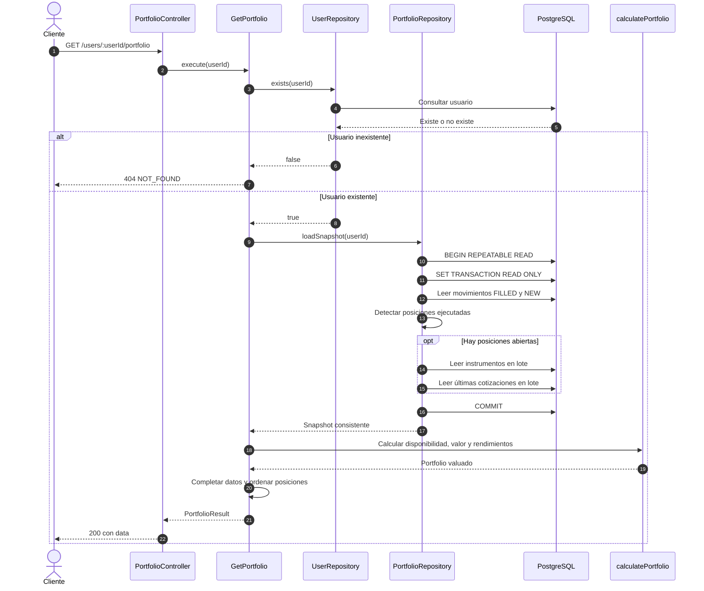

# Secuencia de consulta de portfolio

La existencia del usuario se valida antes de cargar el snapshot financiero. Movimientos, instrumentos y cotizaciones se leen en lote. No se ejecuta una consulta por posición.

Si una posición abierta no tiene los datos necesarios para valuarla, la API devuelve un error controlado en lugar de publicar un total parcial.
