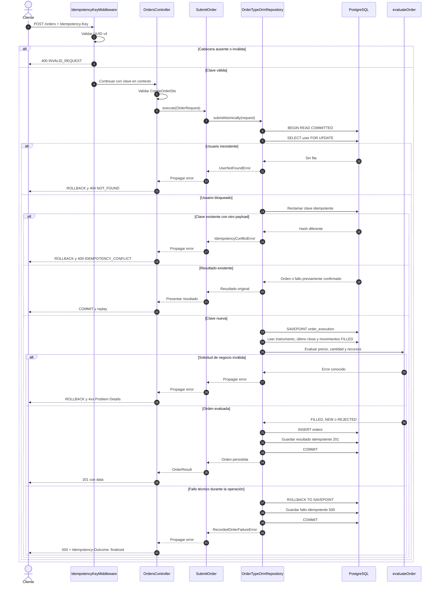

# Secuencia de envío de una orden

La clave idempotente, el resultado y la orden se confirman dentro de la misma transacción. El bloqueo de la fila del usuario serializa el consumo de recursos de una cuenta sin bloquear cuentas distintas.

Si falla el commit o no puede confirmarse el registro idempotente, no se informa el fallo como finalizado. El cliente conserva la misma clave y el mismo body para reintentar, como detalla el [contrato HTTP](../api/README.md#idempotencia-obligatoria).
