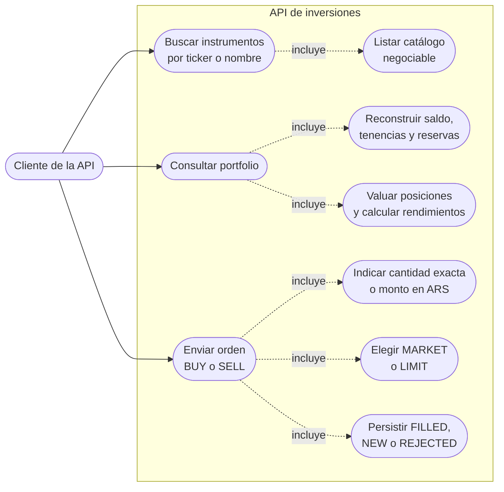

# Casos de uso

El cliente no necesita autenticarse en el alcance del challenge. `CASH_IN` y `CASH_OUT` son movimientos históricos usados para reconstruir recursos. No se pueden enviar mediante `POST /orders`.

La cancelación no forma parte de los tres endpoints solicitados. Si se incorpora, la única transición admitida será `NEW → CANCELLED`, según los [supuestos funcionales](../assumptions.md#disponibilidad-y-órdenes).
